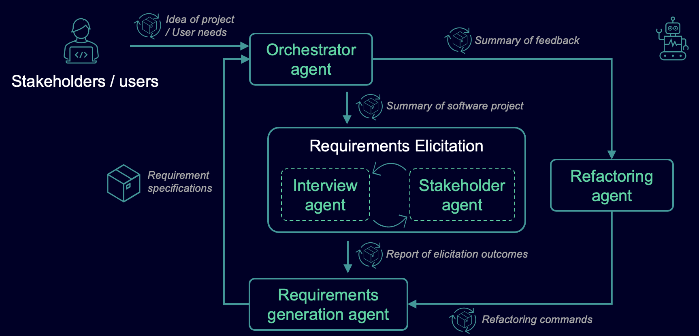

# Agent4RE

Official artifact for **Agent4RE: A Self-refining Multi-agent Framework for
End-to-End Software Requirements Engineering and Benchmarking**.

Agent4RE coordinates specialized LLM agents to turn a short software project
description into an IEEE-style Software Requirements Specification (SRS). The
workflow simulates stakeholder interviews, performs iterative requirements
elicitation, generates an initial specification, and can refine that
specification from user feedback.



## Repository contents

- `requirements_engineering_agent/`: runnable Google ADK agent and prompts.
- `data/project_summary_llm_processed/`: 29 project descriptions used as agent
    inputs.
- `data/requirement_specifications_ieee_1998/`: 29 reference SRS documents in
    IEEE 830-1998 structure.
- `data/requirement_specifications_ieee_2018/`: 18 reference SRS documents in
    IEEE 29148-2018 structure.
- `docs/architecture/`: Agent4RE workflow figure.

This repository intentionally does not include model-generated specifications
or evaluation outputs.

## Quick start

### Prerequisites

- Python 3.10 or newer
- An Azure OpenAI deployment, or a local model served by
    [Ollama](https://ollama.com/)

### Install

```bash
git clone https://github.com/markustyj/Agent4RE_ASE-2026.git
cd Agent4RE_ASE-2026
python -m venv .venv
source .venv/bin/activate
python -m pip install --upgrade pip
python -m pip install -r requirements.txt
cp env.example .env
```

On Windows PowerShell, activate the environment with
`.venv\Scripts\Activate.ps1`.

### Configure a model

All agents use the LiteLLM model identifier in `AGENT4RE_MODEL`.

For Azure OpenAI, edit `.env`:

```dotenv
AGENT4RE_MODEL=azure/gpt-4o
AZURE_API_KEY=your-api-key
AZURE_API_BASE=https://your-resource.openai.azure.com
AZURE_API_VERSION=2025-01-01-preview
```

Microsoft Entra ID authentication is also supported: set
`AZURE_OPENAI_AD_TOKEN` instead of `AZURE_API_KEY`.

For Ollama:

```bash
ollama pull qwen3:8b
```

```dotenv
AGENT4RE_MODEL=ollama_chat/qwen3:8b
```

### Run

Start the Google ADK development interface from the repository root:

```bash
adk web
```

Open the URL printed by ADK and select `requirements_engineering_agent`. Paste
a software project description into the chat. For example, use one of the text
files in `data/project_summary_llm_processed/`.

The agent will:

1. Analyze the project description.
2. Simulate iterative elicitation between interviewer and stakeholder agents.
3. Produce an IEEE-style, MVP-focused SRS.
4. Ask for feedback and regenerate the SRS when refinement is requested.

The elicitation loop is capped at 10 rounds. Agent temperatures follow the
paper configuration: orchestrator `0.5`, interviewer `1.0`, stakeholder `1.0`,
generator `0.8`, and refactoring agent `0.2`.

## RE-E2E benchmark

RE-E2E is designed for end-to-end evaluation from a short project description
to a complete requirements specification. The retained release contains the
project descriptions and human-written reference specifications only. CSV rows
represent SRS sections and their normalized content.

The paper studies three Agent4RE settings: a sequential workflow without
feedback, autonomous self-refinement, and refinement with structured human
feedback. The runnable interface in this repository exposes the complete
interactive workflow, including optional feedback-driven refinement; it does
not reproduce the paper's batch experiments automatically.

## Paper

Agent4RE introduces a five-agent requirements engineering workflow with nested
elicitation and refinement loops. The accompanying RE-E2E benchmark supports
evaluation of complete RE workflows rather than isolated tasks such as
classification or requirement extraction. The paper evaluates Agent4RE across
eight LLMs using lexical and semantic metrics, LLM-as-a-judge, and human review.

The citation will be updated when publication metadata is available. A
machine-readable entry is provided in `CITATION.cff`.

## License

The Agent4RE source code is available under the MIT License. See `LICENSE`.
The benchmark data is not covered by the software license; its redistribution
terms and source provenance must be documented before a public dataset release.

## Contact

Questions and issues can be submitted through the repository issue tracker.

