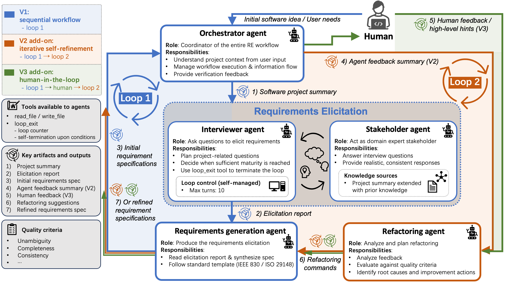

# Agent4RE and RE-E2E

Official repository for **Agent4RE: A Self-refining Multi-agent Framework for End-to-End Software Requirements Engineering and Benchmarking**.

- **RE-E2E benchmark**: an end-to-end requirements engineering benchmark pairing project descriptions with human-written requirement specifications.
- **Agent4RE**: a multi-agent system that transforms a short software project description into an IEEE-style Software Requirements Specification (SRS) through iterative elicitation, generation, and refinement.



## RE-E2E benchmark

RE-E2E evaluates the complete workflow from an initial project description to a finalized requirements specification, rather than an isolated RE task such as classification or extraction.

| Directory | Contents |
| --- | --- |
| `data/project_summary_llm_processed/` | 30 project descriptions used as Agent4RE inputs |
| `data/requirement_specifications_ieee_1998/` | 30 human-written SRS documents normalized to IEEE 830-1998 sections |
| `data/requirement_specifications_ieee_2018/` | 20 human-written SRS documents normalized to IEEE 29148-2018 sections |

Each SRS is stored as CSV with its section hierarchy and normalized textual content. Generated specifications, model responses, and evaluation outputs are intentionally excluded.

## Agent4RE

Agent4RE uses five specialized agents:

- **Orchestrator Agent** coordinates the workflow and communicates with users.
- **Interviewer Agent** asks targeted requirements elicitation questions.
- **Stakeholder Agent** simulates a domain stakeholder and answers those questions.
- **Generation Agent** produces a complete, MVP-focused SRS.
- **Refactoring Agent** converts feedback into concrete specification revisions.

The elicitation loop terminates autonomously and is capped at 10 rounds. The paper studies three operating modes: sequential generation without feedback, autonomous self-refinement, and refinement with structured human feedback. The runnable interface supports initial generation and feedback-driven refinement.

## Quick start

### 1. Install

Python 3.10 or newer is required.

```bash
git clone https://github.com/markustyj/Agent4RE_ASE-2026.git
cd Agent4RE_ASE-2026
python -m venv .venv
source .venv/bin/activate
python -m pip install --upgrade pip
python -m pip install -r requirements.txt
cp env.example .env
```

On Windows PowerShell, activate the environment with `.venv\Scripts\Activate.ps1`.

### 2. Configure a model

All agents use the LiteLLM model identifier in `AGENT4RE_MODEL`.

Azure OpenAI example:

```dotenv
AGENT4RE_MODEL=azure/gpt-4o
AZURE_API_KEY=your-api-key
AZURE_API_BASE=https://your-resource.openai.azure.com
AZURE_API_VERSION=2025-01-01-preview
```

Microsoft Entra ID authentication can use `AZURE_OPENAI_AD_TOKEN` instead of `AZURE_API_KEY`.

Ollama example:

```bash
ollama pull qwen3:8b
```

```dotenv
AGENT4RE_MODEL=ollama_chat/qwen3:8b
```

### 3. Run

```bash
adk web
```

Open the URL printed by Google ADK, select `requirements_engineering_agent`, and provide a software project description. Files in `data/project_summary_llm_processed/` can be used as examples.

## Repository structure

```text
requirements_engineering_agent/   Agent definitions and prompts
data/                              RE-E2E benchmark data
figures/                           Paper and workflow figures
env.example                        Model configuration template
requirements.txt                   Runtime dependencies
```

## Citation

Citation metadata will be added after publication.

```bibtex
% TODO: Add the Agent4RE paper citation here.
```

## License

Agent4RE source code is released under the [MIT License](LICENSE). Benchmark data is excluded from the software license until its source-specific redistribution terms are documented.
